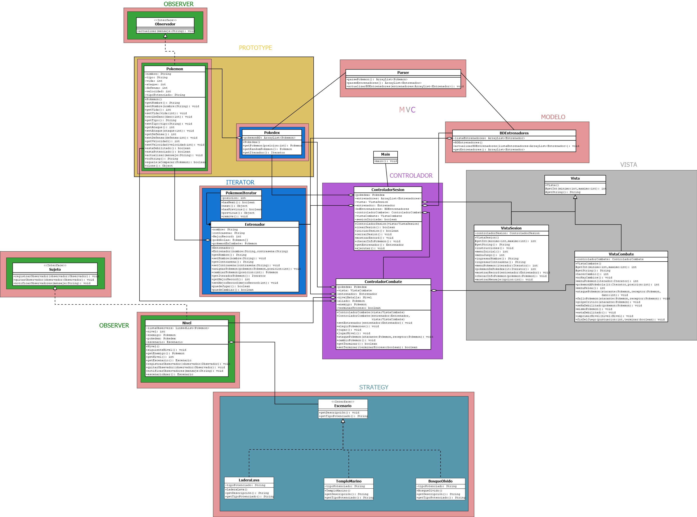

# Proyecto-Modelado-Programacion
Este repositorio contiene mi proyecto de modelado y programación.
El Proyecto consiste en un juego de pokemon bastante básico realmente, el juego 
no se trata de atrapar pokemones si no mas bien de los combates que tienen estos, 
que sin quitar merito es bastante básico. El objetivo de este proyecto es implementar 
distintos patrones de diseño tales como el MVC, Observer, Strategy, Iterator y Prototype. 
Además de utilizar un archivo XML como base de datos para los pokemones y entrenadores(usuarios).
Adujunto una imagen del diagrama UML creado para este proyecto.


Para ejecutar
```
cd '.\Proyecto Modelado y Programcion\src\'

Compilar: javac -cp "lib/jdom-2.0.6/jdom-2.0.6.jar" *.java
Ejecutar: java -cp .:"lib/jdom-2.0.6/jdom-2.0.6.jar" Main

```